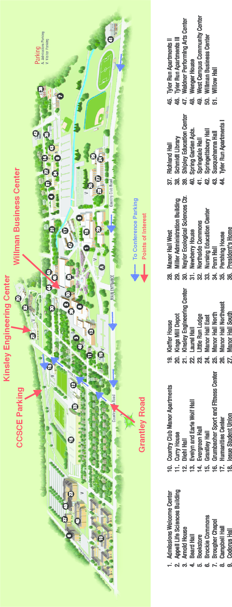

# Local Information
Included below, are driving directions to get to York College campus, how to find your way to conference events, and information about local restaurants and nearby attractions.

It wouldn't be a bad idea to print this out and bring it with you to the conference.

## Directions to York College Campus and Conference Parking

**York College, main campus address:** 441 Country Club Rd, York, PA 17403 
**GPS coordinates for conference parking:** 39.947408, -76.737132

**From New York City:** 
take I-80 west to route 287 south 
continue to route 22/78 west (Clinton) 
then follow I-81 south to Harrisburg 
follow directions from Harrisburg to York 

Or

take the New Jersey Turnpike south to the Pennsylvania Turnpike [I-76] 
follow the directions from Philadelphia to York 
*Approximate driving time: 4 hours*

**From Philadelphia, Pennsylvania:** 
take the Pennsylvania Turnpike [I-76] west to Harrisburg 
take exit 286 - Reading 
follow route 222 south to Lancaster 
follow directions from Lancaster 
*Approximate driving time: 2 1/2 hours*

**From Pittsburgh, Pennsylvania:** 
take the Pennsylvania Turnpike (I-76) east to Harrisburg 
take exit 242 - Harrisburg West Shore 
follow directions from Harrisburg to York 
*Approximate driving time: 4 hours*

**From Lancaster, Pennsylvania:** 
take route 30 west to I-83 south 
follow I-83 south to exit 15 (S George Street) 
follow S George Street to the third traffic light 
turn left onto Country Club Road at Tom's Exxon station 
drive past the main College entrance (on the right) and turn right on Grantley Rd 
drive North a short distance and turn left at the first light (York College Drive / W Jackson St.) 
drive ~500 ft to parking lot entrance, on right 
*Approximate driving time: 45 minutes*

**From Harrisburg, Pennsylvania:** 
follow I-83 south to exit 15 (S George Street) 
follow S George Street to the third traffic light 
turn left onto Country Club Road at Tom's Exxon station 
drive past the main College entrance (on the right) and turn right on Grantley Rd 
drive North a short distance and turn left at the first light (York College Drive / W Jackson St.) 
drive ~500 ft to parking lot entrance, on right 
*Approximate driving time: 45 minutes*

**From Baltimore, Maryland:** 
follow I-83 north to exit 15 (S George Street) 
follow S George Street to the third traffic light 
turn left onto Country Club Road at Tom's Exxon station 
drive past the main College entrance (on the right) and turn right on Grantley Rd 
drive North a short distance and turn left at the first light (York College Drive / W Jackson St.) 
drive ~500 ft to parking lot entrance, on right 
*Approximate driving time: 1 hour*

**From Washington, D.C./Northern Virginia:** 
take the Beltway (I-495) to I-95 north 
take I-695 west 
follow directions from Baltimore 
*Approximate driving time: 2 hours*

## Directions from Conference Hotels to Campus and Conference Parking

**From the Yorktowne**:

* Get on East Market Street
* Turn right onto Queen Street
* Turn right onto E College Ave
* Drive about one mile to Grantley Rd, then turn left
* In about .4 miles, turn right onto York College Drive, then take the first right into the parking lot

**From the Hampton Inn**:

* Turn right onto Queen St and drive about 1.8 miles
* Turn left onto Rathton Rd and drive about 1.2 miles to arrive at the intersection of Rathton Rd and South George Street (the second light)
* Go straight through the intersection and Rathton Road will become Country Club Road
* At the first traffic light, turn right onto Grantley Rd
* At the first traffic light, turn left onto York College Drive, then take the first right into the parking lot

**From Country Inn and Suites**:

* Turn right onto St Charles Way (which will become Dew Drop Rd)
* Turn right onto Powder Mill Road and drive about 1.1 miles
* Turn right onto South George St and drive about 1.1 miles
* At the third traffic light, turn left onto Country Club Rd
* At the first traffic light, turn right onto Grantley Rd
* At the first traffic light, turn left onto York College Drive, then take the first right into the parking lot

**From the Holiday Inn Express**:

* Turn left onto Leader Heights Rd, drive for about .4 miles
* Turn right onto South George St and drive for about 2.6 miles
* Turn left onto Country Club Rd
* At the first traffic light, turn right onto Grantley Rd
* At the first traffic light, turn left onto York College Drive, then take the first right into the parking lot

## Where to go once you arrive on campus

After parking, walk towards Grantley Road.  Cross Grantley Road and walk left towards Kinsley Engineering Center.  Enter Kinsley Engineering Center, then walk all the way through the building and out the back entrance.  Follow the signs reading ``CCSC-E: To Willman'': these will lead you to the Willman Business Administration Building, where registration and the opening session will take place.

## Local Restaurants

**Accomac Inn** 
6330 South River Dr 
717.252.1521

**Chili's** 
1295 Carlisle Rd 
717.845.3280

**Colonial Coffee Shop** 
938 South George St 
717.854.0956

**Cracker Barrel** 
236 Pauline Dr 
717.741.0938

**Esaan Thai Restaurant** 
30 N Beaver St 
717.718.9300

**Hoss's Steak & Sea House** 
2175 White St 
717.854.2966

**Issac's Deli** 
235 Pauline Dr 
717.747.5564

**Olive Garden Italian Restaurant** 
1340 Kenneth Rd 
717.845.2264

**Outback Steakhouse** 
2496 East Market St 
717.757.4363

**Smokey Bones** 
1301 Kenneth Rd 
717.846.3760

**Red Lobster** 
2555 E Market St 
717.757.6624

**The Roosevelt Tavern** 
50 North Penn Street 
717.854.7725

**Ruby Tuesday** 
225 St Charles Way 
717.741.6688

**Wonderful Garden** 
Chinese Restaurant 
2044 Springwood Rd 
717.848.6020

**The Yorktowne Hotel** 
48 East Market St 
717.848.1111

    
## Nearby Attractions

**Downtown York, Pennsylvania** 
Learn about local attractions, activities, and events. 
[http://www.downtownyorkpa.com](http://www.downtownyorkpa.com)

**York County Convention and Visitors Bureau** 
Enthusiastic tourism professionals ready to help you plan your stay in the region. 
[http://www.yorkpa.org](http://www.yorkpa.org)

**York County Economic Alliance** 
The county's primary business resource for developing local businesses and advancing the York community. 
[http://www.ycea-pa.org](http://www.ycea-pa.org)

**InYork.com** 
Find out the latest news in York, plus a complete guide to happenings in York and surrounding communities. 
[http://www.inyork.com](http://www.inyork.com)

**City of York, Pennsylvania** 
Learn why City of York is the first Capitol of the United States, it's local government, and annual grand events like Bike Night.  
[http://www.yorkcity.org](http://www.yorkcity.org)

**York Revolution** 
Cheer for York City's professional baseball team, a member of the Atlantic League of Professional Baseball. 
[http://www.yorkrevolution.com](http://www.yorkrevolution.com)

**Lancaster County, PA** 
Many folks are drawn to Lancaster County for the Amish community, but soon discover and enjoy all the other things to see and do when they visit. 
[http://www.padutchcountry.com](http://www.padutchcountry.com)

**Gettysburg Visitor Center** 
Experience the place where our nation was redefined. 
[http://www.gettysburgfoundation.org](http://www.gettysburgfoundation.org)

**Gettysburg Convention and Visitors Bureau** 
Stay a little longer, and include Gettysburg, the historical place of the American Civil War. Just 28 miles away. 
[http://www.gettysburg.travel](http://www.gettysburg.travel)

**Visit Baltimore** 
There's a lot to love about Baltimore. Come see the best the city has to offer.  
[http://baltimore.org](http://baltimore.org)

**Baltimore County** 
Baltimore County offers a unique blend of rolling hills, exciting sites and attractions, a variety of accommodations, fabulous shopping and historic towns.  
[http://www.enjoybaltimorecounty.com](http://www.enjoybaltimorecounty.com)

**The Maryland Zoo** 
Visit the Maryland Zoo in Baltimore and meet more than 2,000 animals - including chimpanzees, warthogs, elephants, leopards, and more!  
[http://www.marylandzoo.org](http://www.marylandzoo.org)

**Visit Hershey & Harrisburg** 
If it’s the arts, food, history or entertainment you’re searching for…we have what you are looking for! 
[http://visithersheyharrisburg.org](http://visithersheyharrisburg.org)

**Hershey, The Sweetest Place on Earth** 
There is more to this town besides chocolate. Come experience all Hershey has to offer. 
[http://www.hersheypa.com](http://www.hersheypa.com)

**HERSHEYPARK, Hershey, PA** 
From world-class attractions, award-winning resorts, year-round entertainment and events, Hershey has something for everyone.  
[http://www.hersheypark.com](http://www.hersheypark.com)

## Campus Map

